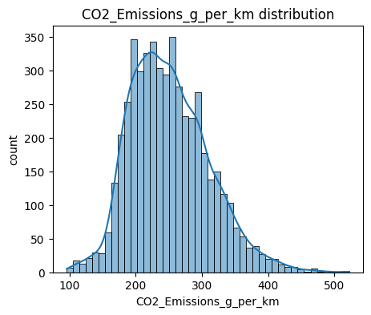
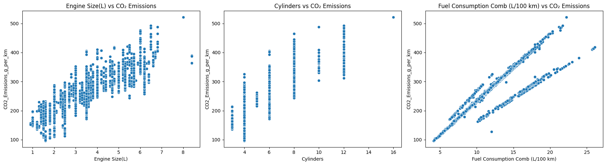
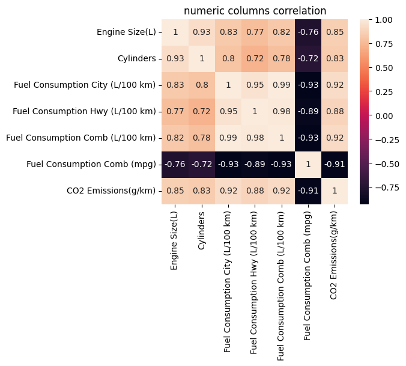
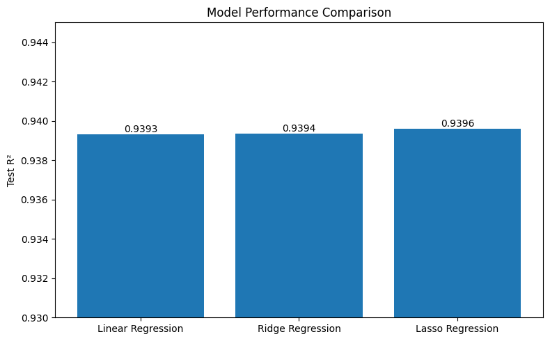

# CO₂ Emission Prediction for Automotive Policy & Design Decisions

## 📌 Project Overview

The Global Automotive Council aims to understand the key factors influencing vehicle CO₂ emissions and explore data-driven strategies for emission reduction.

This case study analyzes vehicle specifications, engine characteristics, fuel type, and fuel consumption to identify the major factors associated with CO₂ emissions and develop a simple, interpretable predictive model.

The project covers data cleaning, exploratory data analysis, correlation analysis, multicollinearity detection using VIF, feature selection, categorical encoding, regression modeling, and model evaluation.

---

## 🎯 Objectives

* Understand the structure and characteristics of the vehicle dataset
* Identify and address data quality issues
* Explore relationships between vehicle characteristics and CO₂ emissions
* Identify multicollinearity among numerical features using VIF
* Select relevant and interpretable features for modeling
* Compare Linear Regression, Ridge Regression, and Lasso Regression
* Evaluate model performance using R² and MSE
* Identify key factors associated with vehicle CO₂ emissions
* Derive data-supported insights for automotive design and policy decisions

---

## 📊 Dataset

The dataset contains information about vehicles, including:

* Vehicle make and model
* Vehicle class
* Engine size
* Number of cylinders
* Transmission
* Fuel type
* City fuel consumption
* Highway fuel consumption
* Combined fuel consumption
* Combined fuel consumption in MPG
* CO₂ emissions

### Dataset Dimensions

| Stage                   |  Rows | Columns |
| ----------------------- | ----: | ------: |
| Initial dataset         | 7,385 |      12 |
| After duplicate removal | 6,282 |      12 |

No missing values were identified in the dataset.

A total of **1,103 duplicate records** were identified and removed, leaving **6,282 unique observations** for analysis.

---

## 🔎 Exploratory Data Analysis

The analysis included:

* Dataset structure and summary statistics
* Unique-value analysis
* Missing-value analysis
* Duplicate detection
* Distribution analysis
* Outlier analysis
* Correlation analysis
* Numerical feature visualization
* Comparison of emissions across fuel categories and vehicle characteristics

The analysis showed that **fuel consumption, engine size, and number of cylinders** have strong relationships with CO₂ emissions.

### CO₂ Emissions Distribution



### Numerical Features vs CO₂ Emissions



---

## 🔗 Correlation Analysis

The selected numerical variables showed the following correlations with CO₂ emissions:

| Feature                          | Correlation with CO₂ Emissions |
| -------------------------------- | -----------------------------: |
| Engine Size(L)                   |                         0.8549 |
| Cylinders                        |                         0.8347 |
| Fuel Consumption Comb (L/100 km) |                         0.9170 |

**Fuel Consumption Comb (L/100 km)** showed the strongest correlation with CO₂ emissions among the selected numerical features.

### Correlation Heatmap



---

## 🧮 Multicollinearity Analysis

Variance Inflation Factor (VIF) was used to identify multicollinearity among numerical predictors.

Initially, the fuel-consumption variables showed extremely high VIF values, indicating substantial redundancy.

Examples:

* Fuel Consumption Comb (L/100 km): **5045.26**
* Fuel Consumption City (L/100 km): **2225.28**
* Fuel Consumption Hwy (L/100 km): **623.63**

Redundant fuel-consumption variables were removed to simplify the feature set and reduce multicollinearity.

### Final Numerical Features

* Engine Size(L)
* Cylinders
* Fuel Consumption Comb (L/100 km)

### Final VIF Values

| Feature                          |  VIF |
| -------------------------------- | ---: |
| Engine Size(L)                   | 8.75 |
| Cylinders                        | 7.35 |
| Fuel Consumption Comb (L/100 km) | 3.08 |

All final VIF values are below 10, so the three numerical features were retained for modeling.

---

## 🛠️ Feature Preparation

The final model uses a compact feature set consisting of:

### Numerical Features

* Engine Size(L)
* Cylinders
* Fuel Consumption Comb (L/100 km)

### Categorical Feature

* Fuel Type

The categorical feature was transformed using **One-Hot Encoding**.

Numerical features were standardized using **StandardScaler**.

Both preprocessing steps were implemented within a scikit-learn pipeline to keep preprocessing consistent during model training and evaluation.

---

## 🤖 Models

Three regression models were developed and compared:

1. **Linear Regression** — baseline model
2. **Ridge Regression** — L2 regularization
3. **Lasso Regression** — L1 regularization

Five-fold cross-validation was used during model evaluation and hyperparameter tuning.

### Selected Hyperparameters

| Model             | Selected Alpha |
| ----------------- | -------------: |
| Linear Regression |              — |
| Ridge Regression  |            0.1 |
| Lasso Regression  |         0.0001 |

---

## 📈 Model Performance

The final model comparison from the notebook is:

| Model                |     Train R² |      Test R² |     Test MSE |
| -------------------- | -----------: | -----------: | -----------: |
| Linear Regression    |     0.938439 |     0.939308 |     222.1386 |
| Ridge Regression     |     0.938477 |     0.939351 |     221.9834 |
| **Lasso Regression** | **0.938978** | **0.939616** | **221.0140** |


### Model Performance Comparison




### Final Model

**Lasso Regression** was selected as the final model because it achieved the highest Test R²:

**Test R² = 0.9396**

This means the model explains approximately **94% of the variation in CO₂ emissions** on the test data.

The close Train and Test R² values indicate that there is no substantial gap between training and test performance.

---

## 💡 Key Findings

### 1. Fuel Consumption

Fuel consumption showed the strongest relationship with CO₂ emissions among the selected numerical variables.

Vehicles with higher fuel consumption generally produced higher CO₂ emissions.

### 2. Engine Size

Larger engine sizes were associated with higher CO₂ emissions.

### 3. Number of Cylinders

Vehicles with more cylinders generally showed higher emission levels.

### 4. Fuel Type

Fuel type contributed to differences in observed CO₂ emission levels.

These relationships should be interpreted as **associations rather than causal effects**.

---

## 🌍 Business & Policy Insights

The analysis suggests several areas that could support automotive decision-making:

* Improving fuel efficiency can help reduce vehicle emissions.
* Engine and cylinder configurations can be considered when designing lower-emission vehicles.
* Fuel-efficiency standards can be informed by vehicle characteristics.
* Vehicle characteristics can be considered when developing emission-reduction strategies.
* Further analysis could investigate how vehicle configuration and fuel type interact with emission levels.

---

## 🧰 Technologies Used

* Python
* NumPy
* Pandas
* Matplotlib
* Seaborn
* Scikit-learn
* Google Colab
* Git & GitHub

---

## 📁 Project Structure

```text
CO2-Emission-Case-Study/
│
├── data/
│   └── Automotive_CO2_Emissions.csv
│
├── images/
│
├── notebooks/
│   └── CO2_Emission_Case_Study.ipynb
│
├── reports/
│
├── .gitignore
├── requirements.txt
└── README.md
```

---

## 📓 Notebook

The complete analysis is available in the project notebook, including:

* Data cleaning
* Exploratory data analysis
* Correlation analysis
* VIF-based multicollinearity analysis
* Feature selection
* Feature preprocessing
* Regression modeling
* Hyperparameter tuning
* Model evaluation
* Residual analysis
* Interpretation of results

---

## 👨‍💻 Author

**S. Venkatesh Prasad**

Computer Science Engineer | Aspiring AI Engineer
